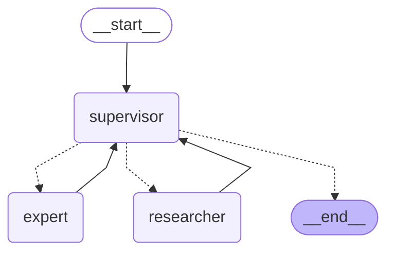

# Pokémon Multi-Agent System

A multi-agent system built with LangGraph/LangChain and FastAPI for answering questions about Pokémon, retrieving Pokémon data, and simulating Pokémon battles.

## System Architecture

The system consists of three specialized agents:

1. **Supervisor Agent (Orchestrator)**
   - Receives user queries and determines the best way to process them
   - Can respond directly to general knowledge questions
   - Delegates specialized tasks to other agents

2. **Researcher Agent**
   - Retrieves information from external APIs (PokéAPI)
   - Fetches details about Pokémon including stats, types, and abilities

3. **Pokémon Expert Agent**
   - Analyzes the data retrieved by the Researcher Agent
   - Determines the probable winner in a Pokémon battle based on stats and type advantages

## API Endpoints

### General Chat Endpoint

```
POST /chat
```

**Input:**
```json
{
  "question": "Who would win in a battle, Pikachu or Bulbasaur?"
}
```

**Expected Output:**
```json
{
  "answer": "Pikachu has an electric-type advantage over Bulbasaur, so it would likely win.",
  "reasoning": "Electric-type moves are strong against Water- and Flying-types, but Bulbasaur is Grass/Poison. However, Pikachu has higher speed and access to strong electric moves."
}
```

### Pokémon Battle Simulation Endpoint

```
GET /battle?pokemon1=pikachu&pokemon2=bulbasaur
```

**Expected Output:**
```json
{
  "winner": "Pikachu",
  "reasoning": "Pikachu has a higher base speed and access to strong electric moves, which are effective against Bulbasaur."
}
```

## Setup and Installation

### Prerequisites

- Python 3.9+
- Docker (optional)

### Environment Variables

Create a `.env` file in the root directory with the following variables:

```
OPENAI_API_KEY=your_openai_api_key
```

You can use any compatible LLM provider by modifying the configuration in `app/graph/agent_graph.py`.

### Installation

#### Using Python

1. Clone the repository:
   ```
   git clone https://github.com/yourusername/pokemon-multi-agent.git
   cd pokemon-multi-agent
   ```

2. Create a virtual environment:
   ```
   python -m venv venv
   source venv/bin/activate  # On Windows: venv\Scripts\activate
   ```
   or with `uv` (recommended):
   ```
   uv venv
   source .venv/bin/activate  # On Windows: .venv\Scripts\activate
   ```

3. Install dependencies:
   ```
   make setup-uv
   ```
   or
   ```
   make setup
   ```
   or
   ```
   pip install -r requirements.txt
   ```

4. Run the application:
   ```
   make PORT=8000 run
   ```
   or
   ```
   uvicorn app.main:app --reload --port 8000
   ```

#### Using Docker

1. Build Docker image:
   ```
   make build-docker
   ```
   or
   ```
   docker build -t pokemon-multi-agent .
   ```
2. Run with Docker Compose:
   ```
   make run-docker  # On Windows: Need to edit docker compose to docker-compose
   ```
   or
   ```
   docker compose up -d  # On Windows: Need to edit docker compose to docker-compose
   ```

3. To stop the Docker container:
   ```
   make stop-docker # On Windows: Need to edit docker compose to docker-compose
   ```
   or
   ```
   docker compose down # On Windows: Need to edit docker compose to docker-compose
   ```

## Usage

Once the server is running, you can access the API at `http://localhost:8000`.

### API Documentation

- Swagger UI: `http://localhost:8000/docs`
- ReDoc: `http://localhost:8000/redoc`

### Example Queries

- General knowledge: "What is the capital of France?"
- Pokémon stats: "What are the base stats of Charizard?"
- Pokémon battle: "Who would win in a battle, Pikachu or Bulbasaur?"

## Testing

Run the tests with:

```
make test
```
or
```
pytest
```

## Project Structure

```
pokemon-multi-agent/
├── app/
│   ├── __init__.py
│   ├── main.py                  # FastAPI application
│   ├── agents/
│   │   ├── __init__.py
│   │   ├── supervisor.py        # Supervisor Agent Prompt and Tools
│   │   ├── researcher.py        # Researcher Agent Prompt and Tools
│   │   └── pokemon_expert.py    # Pokémon Expert Agent Prompt and Tools
│   ├── graph/
│   │   ├── __init__.py
│   │   └── agent_graph.py       # LangGraph configuration
│   ├── models/
│   │   ├── __init__.py
│   │   └── schemas.py           # Pydantic models for API
│   └── utils/
│       ├── __init__.py
│       └── pokemon_utils.py     # Utility functions for Pokémon data
├── tests/
│   ├── __init__.py
│   ├── test_main.py             # API tests
│   └── test_agents.py           # Agent tests
├── Dockerfile
├── docker-compose.yml
├── Makefile
├── requirements.txt
└── README.md
```

## Agent Graph


## Customization

### Using a Different LLM Provider

You can customize the LLM provider in `app/graph/agent_graph.py` by modifying the `create_agent_graph` function. The system is designed to work with any LLM provider compatible with LangChain.

### Adding New Agent Types

To add new agent types:

1. Create a new agent class in the `app/agents/` directory
2. Add the agent to the graph in `app/graph/agent_graph.py`
3. Update the workflow logic as needed

## Contributing

Contributions are welcome! Please feel free to submit a Pull Request.

## License

This project is licensed under the MIT License - see the LICENSE file for details.