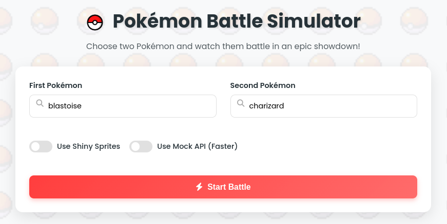
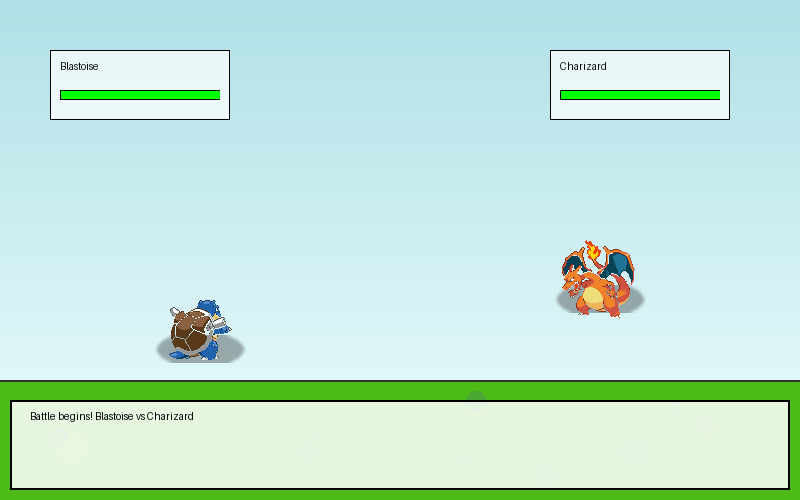
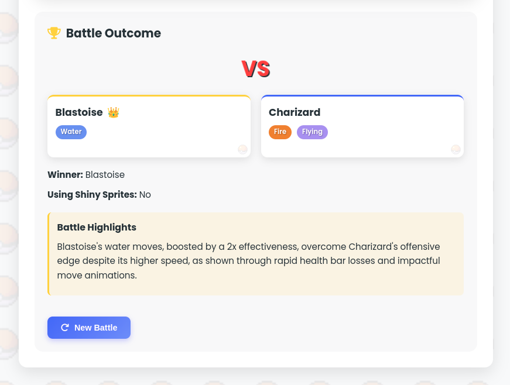
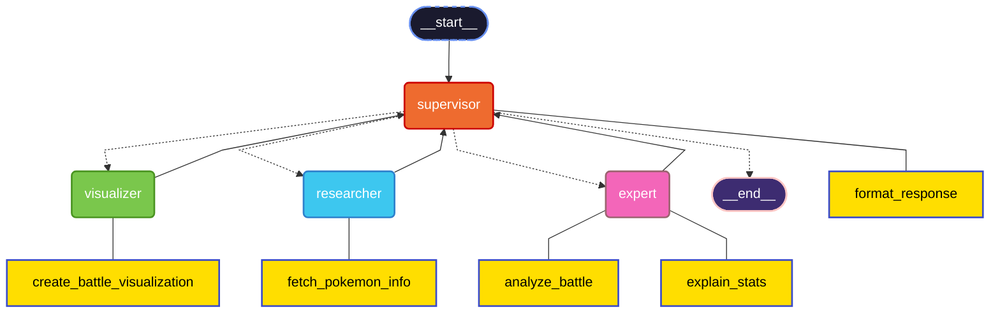

# Pokémon Multi-Agent System

A multi-agent system built with LangGraph/LangChain and FastAPI for answering questions about Pokémon, retrieving Pokémon data, simulating Pokémon battles, and generating battle visualizations.

# Try it out!

The system is deployed to Google Cloud Run and can be accessed at https://pokemon-agent-system-179780044751.us-central1.run.app/battle-tester

## System Architecture

The system consists of four specialized agents:

1. **Supervisor Agent (Orchestrator)**
   - Receives user queries and determines the best way to process them
   - Can respond directly to general knowledge questions
   - Delegates specialized tasks to other agents

2. **Researcher Agent**
   - Retrieves information from external APIs (PokéAPI)
   - Fetches details about Pokémon including stats, types, abilities, and moves

3. **Pokémon Expert Agent**
   - Analyzes the data retrieved by the Researcher Agent
   - Determines the probable winner in a Pokémon battle based on stats, types, and moves
   - Provides detailed reasoning for battle outcomes

4. **Visualizer Agent**
   - Creates visual representations of Pokémon battles
   - Generates animated GIFs showing the battle between two Pokémon
   - Provides battle highlights and descriptions

## API Endpoints

### General Chat Endpoint

```
POST /chat
```

**Input:**
```json
{
  "question": "Who would win in a battle, Pikachu or Bulbasaur?"
}
```

**Expected Output:**
```json
{
  "answer": "Pikachu has an electric-type advantage over Bulbasaur, so it would likely win.",
  "reasoning": "Electric-type moves are strong against Water- and Flying-types, but Bulbasaur is Grass/Poison. However, Pikachu has higher speed and access to strong electric moves."
}
```

### Pokémon Battle Simulation Endpoint

```
GET /battle?pokemon1=pikachu&pokemon2=bulbasaur
```

**Expected Output:**
```json
{
  "winner": "Pikachu",
  "reasoning": "Pikachu has a higher base speed and access to strong electric moves, which are effective against Bulbasaur."
}
```

### Battle Visualization Endpoint

```
GET /battle/visualize?pokemon1=pikachu&pokemon2=bulbasaur&use_shiny=false
```

**Expected Output:**
```json
{
  "visualization_path": "battle_pikachu_vs_bulbasaur_1234567890.gif",
  "description": "Battle between Pikachu and Bulbasaur",
  "pokemon1": "Pikachu",
  "pokemon2": "Bulbasaur",
  "winner": "Pikachu",
  "battle_highlights": "The battle between Pikachu and Bulbasaur was intense! Pikachu used its Electric moves while Bulbasaur countered with Grass, Poison attacks. In the end, Pikachu emerged victorious!",
  "shiny_used": false
}
```

To view the generated visualization:
```
GET /battle/visualize/view/{visualization_path}
```

### Battle Tester UI

A web-based interface for testing battle visualizations:
```
GET /battle-tester
```







## Setup and Installation

### Prerequisites

- Python 3.9+
- Docker (optional)

### Environment Variables

Create a `.env` file in the root directory with the following variables:

```
OPENAI_API_KEY=your_openai_api_key
MODEL_PROVIDER=openai
MODEL_NAME=gpt-4o-mini
DEBUG=false
TEMP_DIR=/tmp
```

You can use any compatible LLM provider by modifying the configuration in `app/graph/agent_graph.py`.

### Installation

#### Using Python

1. Clone the repository:
   ```
   git clone https://github.com/yourusername/pokemon-multi-agent.git
   cd pokemon-multi-agent
   ```

2. Create a virtual environment:
   ```
   python -m venv venv
   source venv/bin/activate  # On Windows: venv\Scripts\activate
   ```
   or with `uv` (recommended):
   ```
   uv venv
   source .venv/bin/activate  # On Windows: .venv\Scripts\activate
   ```

3. Install dependencies:
   ```
   make setup-uv
   ```
   or
   ```
   make setup
   ```
   or
   ```
   pip install -r requirements.txt
   ```

4. Run the application:
   ```
   make PORT=8080 run
   ```
   or
   ```
   uvicorn app.main:app --reload --port 8080
   ```

#### Using Docker

1. Build Docker image:
   ```
   make build-docker
   ```
   or
   ```
   docker build -t pokemon-multi-agent .
   ```
2. Run with Docker Compose:
   ```
   make run-docker  # On Windows: Need to edit docker compose to docker-compose
   ```
   or
   ```
   docker compose up -d  # On Windows: Need to edit docker compose to docker-compose
   ```

3. To stop the Docker container:
   ```
   make stop-docker # On Windows: Need to edit docker compose to docker-compose
   ```
   or
   ```
   docker compose down # On Windows: Need to edit docker compose to docker-compose
   ```

## Usage

Once the server is running, you can access the API at `http://localhost:8080`.

### API Documentation

- Swagger UI: `http://localhost:8080/docs`
- ReDoc: `http://localhost:8080/redoc`

### Example Queries

- General knowledge: "What is the capital of France?"
- Pokémon stats: "What are the base stats of Charizard?"
- Pokémon battle: "Who would win in a battle, Pikachu or Bulbasaur?"
- Battle visualization: Use the `/battle/visualize` endpoint or the Battle Tester UI

## Testing

Run the tests with:

```
make test
```
or
```
pytest
```

## Project Structure

```
pokemon-multi-agent/
├── app/
│   ├── __init__.py
│   ├── main.py                  # FastAPI application
│   ├── agents/
│   │   ├── __init__.py
│   │   ├── supervisor.py        # Supervisor Agent Prompt and Tools
│   │   ├── researcher.py        # Researcher Agent Prompt and Tools
│   │   ├── pokemon_expert.py    # Pokémon Expert Agent Prompt and Tools
│   │   └── visualizer.py        # Visualizer Agent Prompt and Tools
│   ├── graph/
│   │   ├── __init__.py
│   │   └── agent_graph.py       # LangGraph configuration
│   ├── models/
│   │   ├── __init__.py
│   │   └── schemas.py           # Pydantic models for API
│   ├── static/
│   │   └── battle_tester.html   # Web UI for testing battle visualizations
│   └── utils/
│       ├── __init__.py
│       ├── pokemon_utils.py     # Utility functions for Pokémon data
│       ├── mock_battle.py       # Mock battle utilities for testing
│       └── visualization_utils.py # Utilities for generating battle visualizations
├── tests/
│   ├── __init__.py
│   ├── conftest.py              # Pytest configuration
│   ├── test_api.py              # API tests
│   ├── test_agents.py           # Agent tests
│   ├── test_pokemon_utils.py    # Pokemon utils tests
│   ├── test_code_coverage.py    # Code coverage tests
|   └── test_visualization.py    # Visualization tests
├── .github/
│    └── workflows/
│        ├── deploy-cloudrun.yml # Cloud Run deployment workflow
│        └── test.yml            # Test workflow
├── Dockerfile
├── docker-compose.yml
├── Makefile
├── requirements.txt
└── README.md
```

## Agent Graph



## Battle Visualization

The system can generate animated battle visualizations between any two Pokémon. These visualizations:

- Show both Pokémon with their sprites (regular or shiny)
- Animate the battle sequence with attack animations
- Display the winner at the end
- Include battle highlights describing key moments

You can access battle visualizations through:
1. The `/battle/visualize` API endpoint
2. The Battle Tester UI at `/battle-tester`

## Customization

### Using a Different LLM Provider

You can customize the LLM provider in `app/graph/agent_graph.py` by modifying the `create_agent_graph` function. The system supports:

- OpenAI models (default: o3-mini)
- Groq models

Set the provider and model in your `.env` file:
```
MODEL_PROVIDER=openai
MODEL_NAME=gpt-4o-mini
```

### Adding New Agent Types

To add new agent types:

1. Create a new agent class in the `app/agents/` directory
2. Add the agent to the graph in `app/graph/agent_graph.py`
3. Update the workflow logic as needed

Potential new agent types:
- Move Expert: Analyzes Pokémon moves and abilities
- Team Builder: Creates optimal Pokémon teams based on strategies
- Evolution Specialist: Provides guidance on evolution chains and methods
- Item Expert: Advises on the best items for specific Pokémon
- Meta Analyst: Analyzes current competitive Pokémon meta trends
- Training Advisor: Provides EV/IV training recommendations

## LangSmith Tracing

The system supports [LangSmith](https://smith.langchain.com/) tracing for monitoring, debugging, and optimizing the LLM application workflow. LangSmith provides visibility into:

- Agent execution paths
- Tool usage and performance
- LLM prompt/response pairs
- Execution times and token usage

### Setting up LangSmith Tracing

1. Create a LangSmith account at [LangSmith](https://smith.langchain.com/)
2. Add the following variables to your `.env` file:
   ```
   LANGSMITH_TRACING=true
   LANGSMITH_ENDPOINT="https://api.smith.langchain.com"
   LANGSMITH_API_KEY="your_langsmith_api_key"
   LANGSMITH_PROJECT="your_langsmith_project"
   ```

3. Monitor your agent runs in the LangSmith UI to:
   - Debug agent decision-making
   - Optimize prompts and tools
   - Analyze token usage and performance
   - Share traces with your team

### Benefits of LangSmith Tracing

- **Debugging**: Visualize the complete execution flow of each agent, including internal reasoning steps
- **Prompt Optimization**: Analyze which prompts are most effective for different agent roles
- **Performance Monitoring**: Track token usage, latency, and other metrics to identify bottlenecks
- **Quality Assurance**: Evaluate agent outputs and decision quality over time
- **Collaboration**: Share traces with team members to collaboratively debug and improve the system

The system uses the `@traceable` decorator on key functions to automatically send execution traces to LangSmith when enabled.

## Contributing

Contributions are welcome! Please feel free to submit a Pull Request.

## License

This project is licensed under the MIT License - see the LICENSE file for details.
